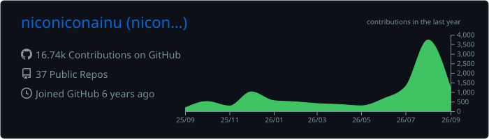
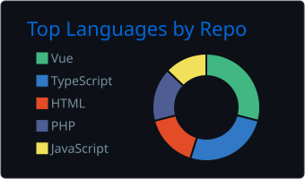
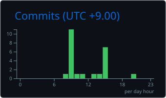

<picture>
  <source media="(prefers-color-scheme: dark)" srcset="./assets/header-dark.svg">
  <source media="(prefers-color-scheme: light)" srcset="./assets/header-light.svg">
  
</picture>

  

 

---

## `whoami`

個人開発者 / **solo developer in Japan**, running a one-person studio called **mulvolin-atelier**.

I take products end to end — domain model, API, infrastructure, store submission, and the
writing that comes after. Most of the day-to-day execution is delegated to a fleet of AI agents
I orchestrate; my job is the part they can't do — deciding what is worth building, and saying no.

Mobile is where I ship today. Before that it was the web, and I still work comfortably in
**Laravel** and **Vue** — a good part of what I've built runs on them.

**I build in public** on [**@tinkerpochi**](https://x.com/tinkerpochi) — the failures included.
A greyed-out subscribe button that got an app rejected; a day lost to Android console
configuration. Those tend to be the useful posts.

 

## 🧰 Stack

**Language**

   

**Mobile**

 

**Front-end**

    

**Back-end & Data**

     

**Infra & Tooling**

     

**Agents**

  

 

## ✍️ Writing

I write up the things that actually went wrong — store rejections, console configuration,
where to split sandbox from production. 日本語と英語の両方で書いています。

  

 

## 📊 GitHub

<picture>
  <source media="(prefers-color-scheme: dark)" srcset="./profile-summary-card-output/github_dark/0-profile-details.svg">
  <source media="(prefers-color-scheme: light)" srcset="./profile-summary-card-output/github/0-profile-details.svg">
  
</picture>

<picture>
  <source media="(prefers-color-scheme: dark)" srcset="./profile-summary-card-output/github_dark/1-repos-per-language.svg">
  <source media="(prefers-color-scheme: light)" srcset="./profile-summary-card-output/github/1-repos-per-language.svg">
  
</picture>
<picture>
  <source media="(prefers-color-scheme: dark)" srcset="./profile-summary-card-output/github_dark/4-productive-time.svg">
  <source media="(prefers-color-scheme: light)" srcset="./profile-summary-card-output/github/4-productive-time.svg">
  
</picture>

  

<picture>
  <source media="(prefers-color-scheme: dark)" srcset="https://raw.githubusercontent.com/niconiconainu/niconiconainu/snek/snek-dark.svg">
  <source media="(prefers-color-scheme: light)" srcset="https://raw.githubusercontent.com/niconiconainu/niconiconainu/snek/snek-light.svg">
  
</picture>

 

Cards and snake are generated by this repo's own workflows and committed here — no third-party image host to go down.

